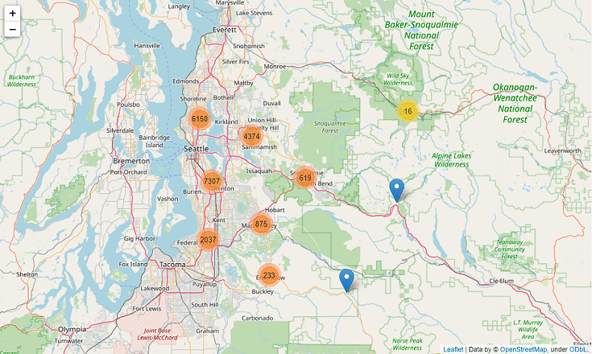

### Projeto - Prevendo Preço de Casas em King County

  

Neste projeto realizamos uma análise exploratória dos dados e previsão utilizando machine learning. Como queremos prever o valor de venda das casas, esse é um típico problema de regressão. Por conter dados históricos de preço, trata-se de um problema de aprendizado de máquina supervisionado. No módulo de aprendizado de máquina buscamos testar algoritmos que são conhecidos pelo seu poder de previsão em dados tabulares, como XGBoost, CatBoost e LightGBM. Utilizamos ainda o algoritmo Random Forest tanto para realizar as previsões como para selecionar as variáveis mais relevantes no conjunto de variáveis.

Os resultados podem ser vistos na tabela abaixo e indicam que os algoritmos ensemble se saíram muito bem, como esperado já que os dados do problema são tabulares. O algoritmo CatBoost foi o que se saiu melhor tanto nas métricas de avaliação quanto na avaliação do gráfico que compara o desempenho dos dados de treino e teste, onde aparenta ter uma menor dispersão em relação aos valores originais.

